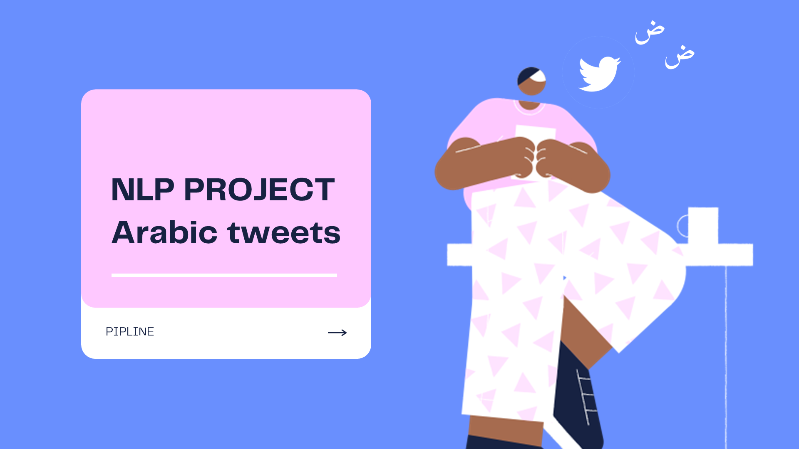
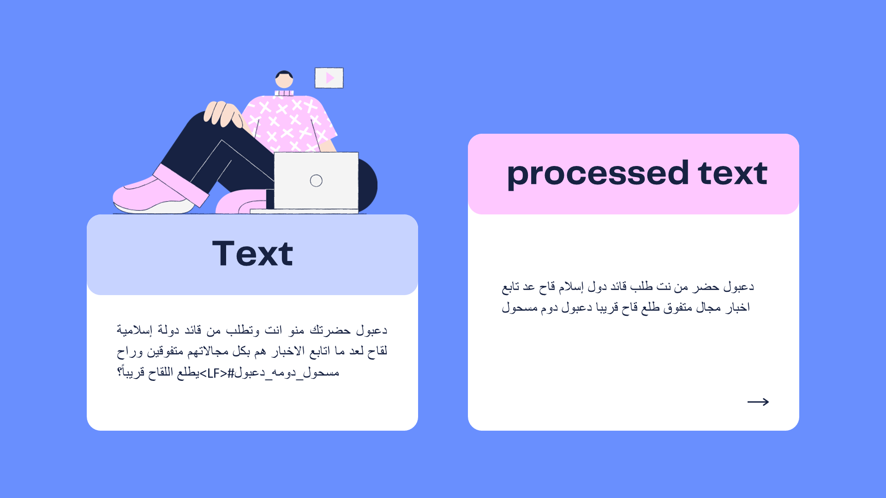
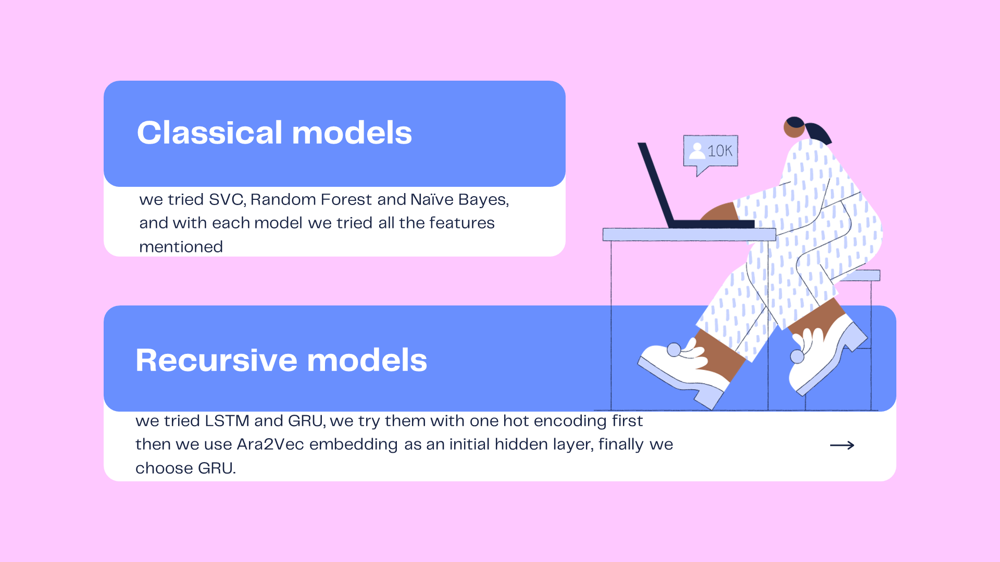
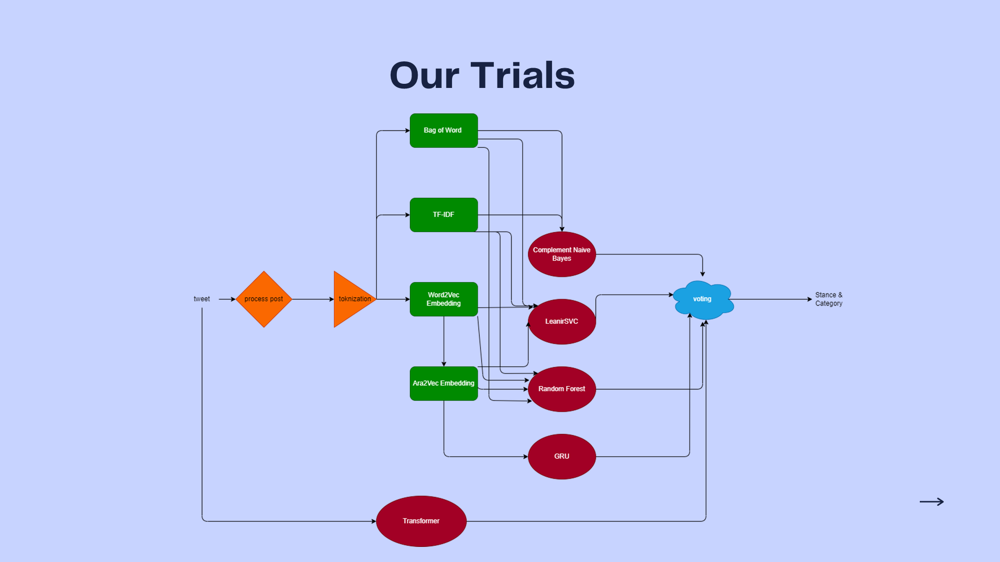
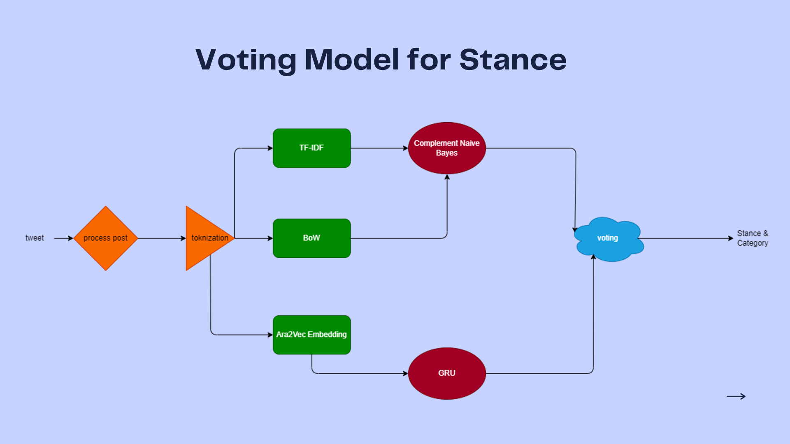
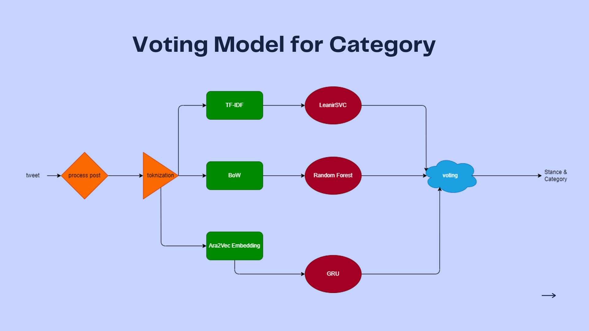
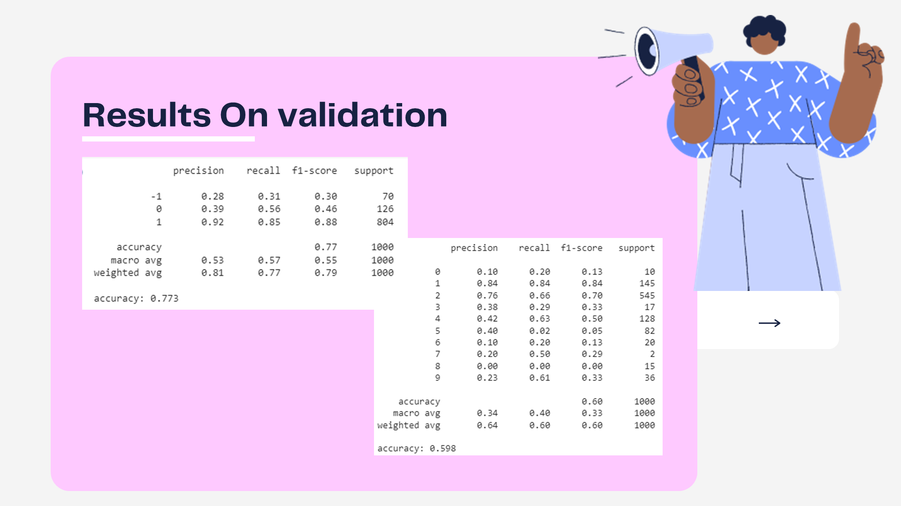
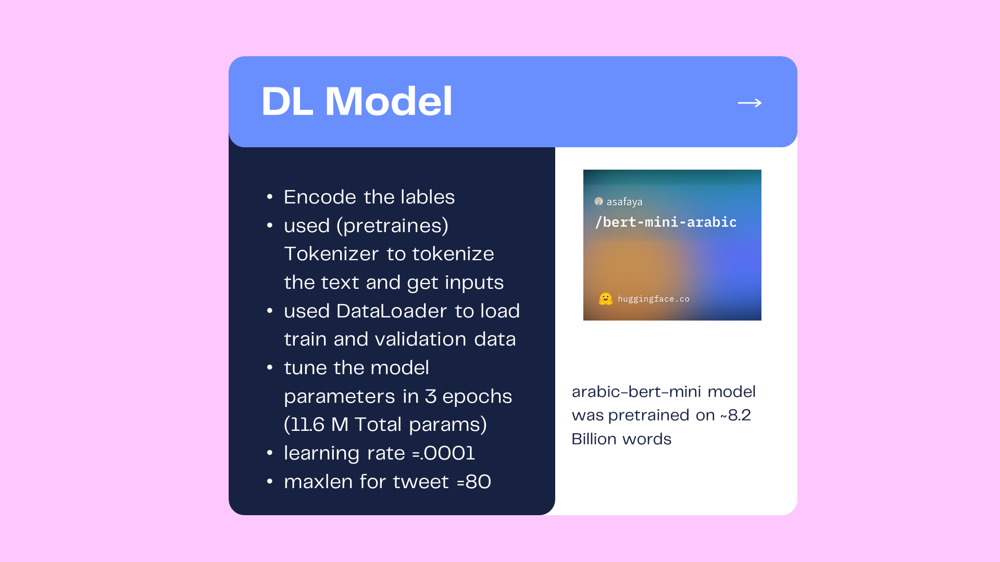
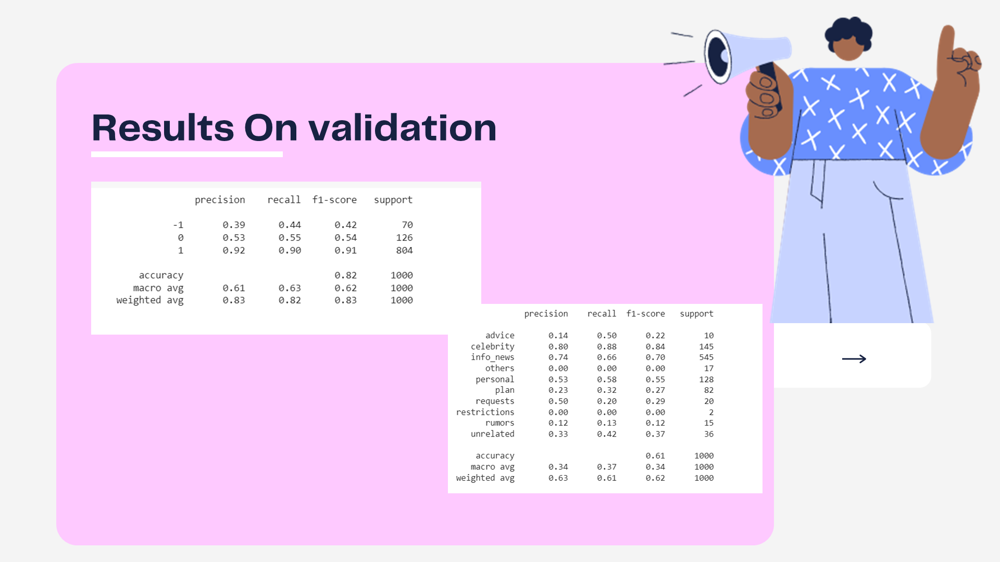

# Arabic-Tweets-Sentiment-Classification
Using NLP principles we need to build a model that analysis Arabic tweets that related to COVID-19 

---

---

---

---

---

---

---

---

---

---

---

---

